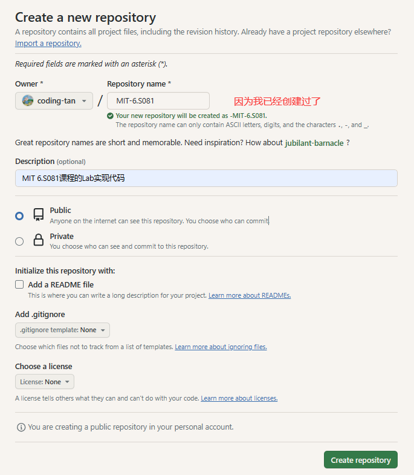
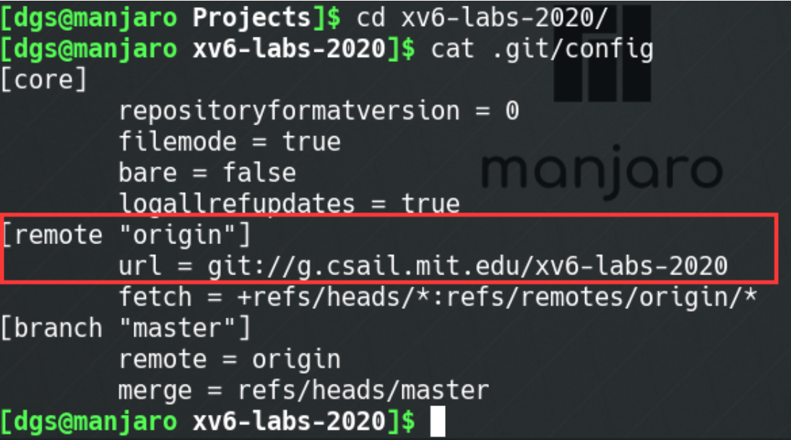
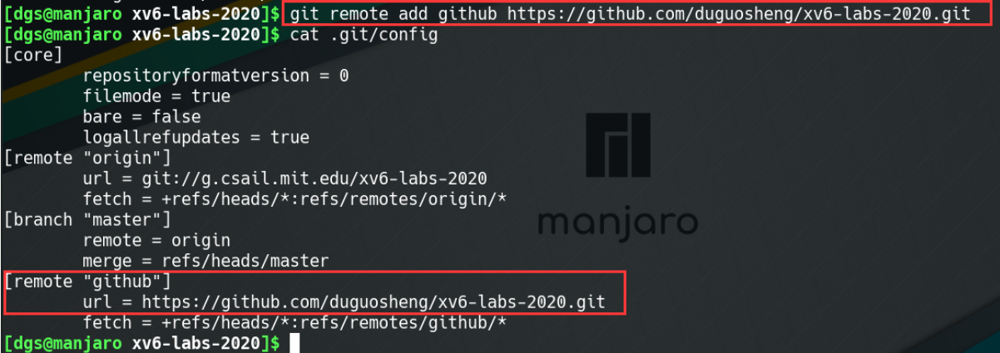

## 环境搭建指南

本指南将帮助您搭建 MIT-6.S081 课程所需的开发环境。

## 运行环境

- 操作系统：Linux、macOS 或 Windows Subsystem for Linux（WSL）
- 基本的命令行知识
- 在您的系统上安装了 Git

> 我使用的是基于Vmware虚拟机上的Ubuntu 20.04.5 LTS

## 步骤

 **Attention**：MIT 6.S081 这门课程每个lab对应一个git分支，所以请不要擅自将***.git\***目录删除或更改origin指向的仓库地址

### 1. 克隆 MIT-6.S081 仓库

打开终端并运行以下命令来克隆仓库：

```
git clone git://g.csail.mit.edu/xv6-labs-2020
```

### 2. 在github创建一个新的空仓库

创建完成后会有提示代码，请**不要**根据提示代码操作，并且记下右图中红色标注的仓库地址



复制仓库地址，建议ssh格式的连接传输更稳定

```c
# https
https://github.com/coding-tan/MIT-6.S081
# ssh
git@github.com:coding-tan/MIT-6.S081.git
```

### 3. 添加git仓库地址
查看本地仓库的git配置文件，可以看到***origin\***主机名下已经有了对应的上游仓库地址

```
cd xv6-labs-2020/
cat .git/config
```



因此我们不要使用***origin\***，可以使用其他主机名对应到github仓库，例如，我使用***github\***

```
git remote add github 你的仓库地址
cat .git/config
```




### 4. HTTPS URL推送失败，换ssh推送

#### 1.检查ssh密钥是否存在

在本地检查是否存在 SSH 密钥。默认情况下，它们存储在用户的 `~/.ssh` 目录下。

```bash
ls -al ~/.ssh
```

#### 2.生成新的SSH密钥

如果没有 SSH 密钥或者需要新的密钥，可以生成一个新的 SSH 密钥：

```ssh
ssh-keygen -t rsa -b 4096 -C "your_email@example.com"
```

替换 `"your_email@example.com"` 为你的 GitHub 注册邮箱。

#### 3.添加SSH密钥到Github账户

复制公钥内容：

```ssh
cat ~/.ssh/id_rsa.pub
```

将输出的公钥内容复制，然后在 GitHub 上的设置中添加一个新的 SSH 密钥。进入 GitHub 帐户的 Settings -> SSH and GPG keys -> New SSH key，并将公钥粘贴到那里。

#### 4. 将更改推送到 GitHub

**`git push`命令**

- **功能**：`git push`命令用于从将本地的分支版本上传到远程并合并。
- **命令格式**：

```bash
git push <远程主机名> <本地分支名>:<远程分支名>
```

如果本地分支名与远程分支名相同，则可以省略冒号：

```bash
git push <远程主机名> <本地分支名>
```

在进行更改后，将它们推送到您的 GitHub 仓库：

```bash
git push github master
//下面是推送成功信息
Enumerating objects: 3, done.
Counting objects: 100% (3/3), done.
Delta compression using up to 4 threads
Compressing objects: 100% (2/2), done.
Writing objects: 100% (3/3), 341 bytes | 341.00 KiB/s, done.
Total 3 (delta 0), reused 2 (delta 0)
To github.com:coding-tan/MIT-6.S081.git
 * [new branch]      master -> master
```

### 5.**将实验代码推送github仓库**

例如：将实验1用到的***util\***分支推送到github

```bash
git checkout util
git push github util:util
```

需要你输入账户密码，提交就成功了

其他实验仓库的提交同理

### 6.****xv6实验git分支建议****

建议是每个实验创建一个测试分支，例如对于***util\***来说

```bash
git checkout util         # 切换到util分支
git checkout -b util_test # 建立并切换到util的测试分支
```

这个命令将创建一个名为 `util_test` 的新分支，并且会立即切换到这个新创建的分支上。

如果 `util_test` 分支已经存在，可以使用以下命令切换到这个分支:

```
git checkout util_test
```

当你在***util_test\***分支中每测试通过一个作业，请提交（`git commit`）你的代码，并将所做的修改合并（`git merge`）到***util\***中，然后提交（`git push`）到github

```bash
git add .
git commit -m "完成了第一个作业"
git checkout util
git merge util_test
git push github util:util
```

#### 1. 将本地分支与远程仓库关联

使用以下命令将本地分支（比如 `util_test` 分支）与远程仓库关联：

```
git push -u github util_test
```

这个命令将把本地的 `util_test` 分支推送到名为 `github` 的远程仓库（GitHub 仓库）上。 `-u` 参数会建立本地分支和远程分支之间的关联关系，使得在以后的推送中可以简化命令。

如果远程仓库中还不存在名为 `util_test` 的分支，这个命令将会在远程仓库创建一个新的 `util_test` 分支，并将本地分支内容推送到远程仓库。

#### 2. 推送分支更改

一旦你与远程仓库关联了分支，以后可以使用以下命令将本地分支的更改推送到远程仓库：

```
git push github util_test
```

这个命令将会将本地的 `util_test` 分支的更改推送到名为 `github` 的远程仓库（GitHub 仓库）上的 `util_test` 分支。此后，在每次进行新的提交后，可以使用该命令将更改推送到远程仓库。

### 7. Pull拉取远程仓库的更改到本地仓库

要拉取（Pull）远程仓库的更改到本地仓库，可以使用 `git pull` 命令。这个命令将会从远程仓库获取最新的更改并将其合并到当前所在分支。

以下是使用 `git pull` 命令的示例：

```
git pull github main
```

这个命令会从名为 `github` 的远程仓库的 `main` 分支拉取最新的更改到你当前所在的分支中。如果远程仓库中有新的提交，`git pull` 会自动将其下载并尝试将其合并到你当前所在的分支。

如果你想要从远程仓库拉取其他分支的更改，只需将 `main` 替换为你想要拉取的分支名称。

## 总结

您已成功搭建了 MIT-6.S081 课程的环境。
