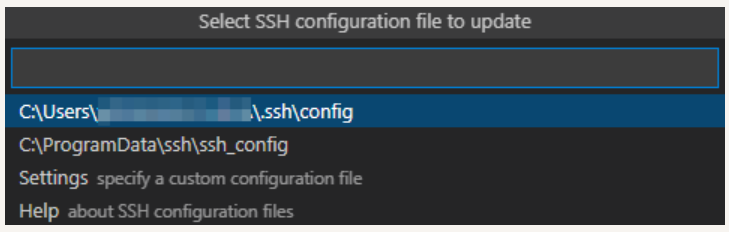

### 安装SSH服务并获取远程访问的IP地址

1. 在Ubuntu系统中，打开终端工具，执行如下命令安装SSH服务。

   ```
   说明
   如果执行该命令失败，提示openssh-server和openssh-client依赖版本不同，请根据CLI界面提示信息，安装openssh-client相应版本后（例如：sudo apt-get install openssh-client=1:8.2p1-4），再重新执行该命令安装openssh-server。
   ```

   ```
   sudo apt-get install openssh-server
   ```

2. 执行如下命令，启动SSH服务。

   ```
   sudo systemctl start ssh
   ```

   

3. 执行如下命令，获取当前用户的IP地址，用于Windows系统远程访问Ubuntu环境。

   ```
   ifconfig
   ```

   ```
   说明
   如果执行ifconfig命令提示“command-not-found”，请执行**sudo apt-get install net-tools**命令安装网络查询工具，然后重新查询IP地址。
   ```

   

   

### 安装Remote SSH

1. 打开Windows系统下的Visual Studio Code，点击，在插件市场的搜索输入框中输入“remote-ssh”。


2. 点击Remote-SSH的**Install**，安装Remote-SSH。安装成功后，在**INSTALLED**下可以看到已安装Remote-SSH。


### 远程连接Ubuntu环境

1. 打开Windows系统的Visual Studio Code，点击，在**SSH TARGETS**下，单击+。

   

2. 在弹出的SSH连接命令输入框中输入“ssh *username*@*ip_address*”，其中ip_address为要连接的远程计算机的IP地址，username为登录远程计算机的帐号。

```
# @前面的是username
username@ubuntu:~$  
```


3. 在弹出的输入框中，选择SSH configuration文件，选择默认的第一选项即可。



4. 在SSH TARGETS中，找到远程计算机，点击，打开远程计算机。


5. 首次连接时，在弹出的输入框中选择**Linux**，然后再选择**Continue**，然后输入登录远程计算机的密码，连接远程计算机 。

   说明：在Windows系统远程访问Ubuntu过程中，需要频繁的输入密码进行连接，为解决该问题，您可以使用SSH公钥来进行设置，设置方法请参考[注册远程访问Ubuntu环境的公钥](https://device.harmonyos.com/cn/docs/documentation/guide/ide-registering-public-key-0000001247162706)。


6. 连接成功后，等待在远程计算机用户目录下的.vscode-server文件夹下自动安装插件，安装完成后，根据界面提示在Windows系统下重新加载Visual Studio Code，便可以在Windows的DevEco Device Tool界面进行源码开发、编译、烧录等操作。

至此，环境搭建完成，如下图所示，左下角显示远程连接计算机的IP地址。


### 参考资料
https://device.harmonyos.com/cn/docs/documentation/guide/ide-install-windows-ubuntu-0000001194073744#section1566312395170
